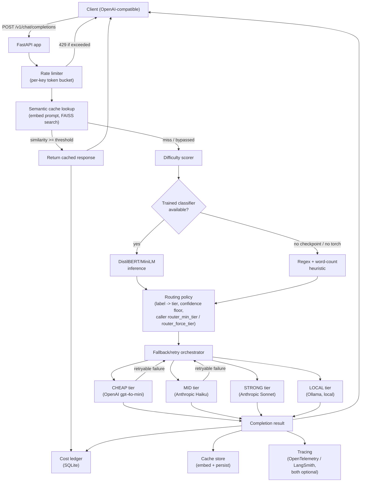

# Architecture

## Request flow

## Design decisions and why

**Tiers, not specific models.** `app/router/tiers.py` maps a small set of
named tiers (CHEAP/MID/STRONG/LOCAL) to specific (provider, model) pairs in
one place. Routing logic never references a model name directly -- swapping
which model backs "strong" is a one-line change, not a search-and-replace.

**Every heavy dependency is optional at import time.** torch/transformers
(classifier), faiss (semantic cache), and the OpenTelemetry/LangSmith SDKs
are all imported lazily, inside the function that needs them, guarded by
try/except or an existence check. `app/main.py` boots and serves requests
correctly with none of them installed -- difficulty scoring falls back to
a heuristic, the cache is simply disabled, tracing is a no-op. This is what
let the whole system be built and reasoned about on a machine with no GPU
and no intention of running a training job locally.

**Fallback escalates up the tier ladder, not sideways.** A retryable
failure (timeout, 5xx, rate limit) retries a couple of times at the current
tier, then escalates to the next tier up rather than trying a different
provider at the same cost level. The reasoning: if gpt-4o-mini is having
issues, the fallback goal is "still answer this well," not "find another
cheap option" -- escalating is both simpler and a better bet on quality.

**Confidence-gated escalation.** A low-confidence difficulty prediction
escalates one tier up rather than being trusted at face value. The
intuition: a confidently-easy prompt is safe to send cheap; an uncertain
one isn't, and one escalated tier occasionally is far cheaper than a wrong
answer on a request that actually mattered.

**The semantic cache is a separate rung from the model ladder, not a
tier.** A cache hit is checked before difficulty scoring even runs --
there's no reason to classify a prompt you're not going to route.

**Cost tracking is SQLite, not an external service.** One less thing to
stand up for `docker-compose up` to be genuinely one command. Swap for
Postgres/ClickHouse only if you outgrow it.

**Streaming is not implemented.** Wiring `stream=true` through the
fallback/retry/cache layers is a real design problem (once you've streamed
half a response to the client, you can't "retry" on a mid-stream failure
the way this router retries a non-streamed call) and was explicitly out of
scope for getting the full system running end-to-end in one pass. The
endpoint returns 501 for `stream: true` rather than silently ignoring it.

## What's still a placeholder, on purpose

- **The heuristic difficulty scorer** (`app/router/heuristic.py`) is a
  regex/word-count classifier, not a claim of accuracy. It exists so the
  whole system works before any fine-tuning happens. The benchmark is what
  tells you whether the trained classifier (once you run the Colab
  notebook in `training/`) is worth switching to.
- **Difficulty-dataset labels** (`training/prepare_dataset.py`) are
  dataset-source-driven (GSM8K -> hard, MMLU -> medium, hand-written ->
  easy), not per-example difficulty measurements. See that file's
  docstring for a better (costlier) alternative.
- **Cost numbers** (`app/router/tiers.py`) are realistic placeholders for
  per-1K-token pricing as of when this was written, not fetched from a
  live pricing API. Update them when they drift.
- **Chat-prompt benchmark quality** is ungraded by default (no single
  correct answer) -- see `benchmark/grade.py` for the opt-in LLM-judge mode
  and why it isn't the default.

## Deployment

`docker-compose.yml` runs the API, and optionally a local Ollama
container for the LOCAL tier. Everything else (OpenAI/Anthropic) is an
outbound HTTPS call, no additional infrastructure. See the root `README.md`
for the one-command startup.
